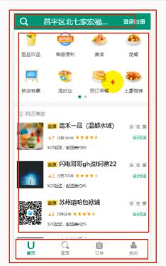

# vue 外卖
# day1
# ####################################1.技术选型：
# 1）vue +ES6 +webpack（打包）
# 2）前台数据处理，交互，组件化可能使用到的插件和第三方库：
- vue-router:开发SPA应用　
- axios:进行前后台数据交互
- vuex:管理应用组件状态
- better-scroll/vue-scroll:实现页面滚动效果
- mockjs:模拟后端数据，
- mint-ui:构建界面
# ####################################2.SPA应用开发
# 1）搭建项目 vue-cli(npm install -g vue-cli  vue init webpack gshop  cd gshop  npm install npm run dev)
# 2）项目结构
- gshop
|-- build : webpack 相关的配置文件夹
|-- config: webpack 相关的配置文件夹
	|-- index.js: 指定的后台服务的端口号和静态资源文件夹（后期需要配置代理:'proxy'）
|-- node_modules:当前应用的依赖
|-- src : 源码文件夹
	|-- main.js: 应用入口 js
|-- static: 静态资源文件夹（全局样式）
|-- .babelrc: babel 的配置文件
|-- .editorconfig: 通过编辑器的编码/格式进行一定的配置
|-- .eslintignore: eslint 检查忽略的配置
|-- .eslintrc.js: eslint 检查的配置（可以修改规则是否打开 或者关闭）
|-- .gitignore: git 版本管制忽略的配置
|-- index.html: 主页面文件
|-- package.json: 应用包配置文件（当前应用相关信息的配置，应用名称，版本号，依赖，运行的命令）
# 3）编码测试与打包发布
# 开发环境运行 npm run  dev（在内存中对项目进行编译打包，并打开浏览器运行(npm  start也可以)）
# 生产环境打包运行  npm  run  build  发布运行（npm  i -g serve下载serve工具包，部署运行dist文件夹）server dist
# 4）标注图（获取）
- 图片Base64：引用的小图片在webpack打包会自动处理转换为样式内部的Base64编码字符串（打包工具以及帮我们做好了）
- 把图片转换成字符串（就成为文件内部的一个部分，不用发送请求），显示时仍然是图片，减少浏览器发送请求的次数；
- 
- 但图片文件不能太大，文件大转换的时间较长，
- 2X和3X图:为了适应不同手机，手机屏幕密度不同
- iconfont：阿里字体图标（引入到index.html文件中）
# 5）项目源码目录设计

# 6）使用Stylus 预编译器
- npm install stylus stylus-loader --save-dev
- (stylus将stylus代码转义成css代码
- stylus-loader 让webpack能够识别stylus)
- 在组件中用stylus语法：<style lang="stylus" rel="stylesheet/stylus">
- 
- 结构化(通过缩进控制 ，不需要大括号和分号)
- 父级引用&
- 变量：mainColor = #0982c1    color mainColor
- 混合Mixins复用CSS

# ####################################3.整体vue应用组件结构
# 
# 
########1)头部的处理###############
- 1.将头部放在路由组件的外面，跟底部一样
- 2.**将头部与中间的路由组件放在一起  整体作为路由组件部分**
- 3.每个路由组件都有类似的头部，可以将类似的结果抽取成一个单独的组件
#########2)定义各个vue组件  基本代码（）
- App.vue
    FooterGuide.vue(底部组件是非路由组件，用来切换路由组件)
	
	Msite.vue (主页)
	Search.vue(搜索组件)
	Oreder.vue(订单组件)
	Personal.vue(个人组件)
- 
# 3）移动端开发，修改viewport视口  解决300ms延时的问题，引入reset.css
# day2
# 4)引入路由 
# 下载vue-router  npm install --save  vue-router
# -------定义路由器 router  index.js----在路由器中配置路由-----在main.js中配置路由器会产生3个标签2个属性 1.标签：<route-link><router-view><eep-alive>  2.属性：$route  $router
# -------修改App.vue  两层结构：上面是路由 下面是导航(引入导航映射成标签)
####################### FooterGuide导航组件#################################################
#1） 通过编程式导航实现路由的切换显示$router
#2）通过class 和 $route.path 来实现tab样式切换
# 导航组件静态页面实现：
-1. 导航栏跟请求路径一致时显示的是on这个样式 要用到class强制样式绑定，根据路径来判断是否有on样式
-2. 点击tab项切换路由  点击监听 
-定义goTo(路径)  this.$router.replace(path)切换路由
# 4个路由组件的静态页面实现
-1.MSite路由组件 由3部分组成  头部 导航  附近商家（根据定位显示）
使用到了stylus的混合  根据像素比来使用2x和3x图
-2.Search路由组件： 由头部和搜索表单组成
-3.Order路由组件
-4.Personal路由组件
# 将4个路由组件的头部抽取成一个非路由组件   slot占位符  props
-在react中有UI组件和容器组件之分  在vue里面有类似的两类组件但是没有用react里面的名字
-1.将头部相关的html代码和css代码抽取到HeaderTop组件中
-2.头部中间内容都是文字，需要声明一个变量接收数据
-3.头部左边和右边 可能有 可能没有内容用slot占位符表示
-4.组件定义好后，去每个组件中引入HeaderTop 映射成标签，使用
# 首页轮播实现
-，使用swiper实现图片轮播    (npm install --save swiper不行)
- 参照官网 写JS代码  在创建Swiper对象时  页面应该已经显示 mounted()
- npm install swiper vue-awesome-swiper --save
- 在页面引入
- import Swiper from 'swiper'
- import 'swiper/swiper-bundle.css'
- 
# MSite商家列表抽取成一个组件  shopList一般组件  
-图片资源
# 登录注册静态组件 
-点击注册登录 模块 跳转到注册登录界面 login（一级路由）
-一般组件映射成标签 ，路由组件映射成路由router  index.js
-router-link路由连接 包裹 跳转的地方 不再是a标签
-登录界面完成
-tab栏 隐藏  （只有4个路由需要 ） $route当前路由  在配置路由的时候可以配置meta属性
meta   $route.meta meta需要在配置路由的时候配置
-
# 启动后台测试
# 前后台交互
# npm i --save  axios
# day3
-1.启动后台服务 通过postman测试接口
-2.二次封装ajax()(返回的是promise对象)
-3.根据接口文档  封装接口请求函数
-4.使用git对项目进行版本控制
 ------1 生成本地仓库  git init    git  add *   git commit -m  'init gshop'
 ------2 创建远程仓库  复制：git remote add origin https://github.com/dingziyong/gshop.git
主要删除  与github 相关的凭据
 ------3 将本地仓库推送到远程仓库  执行上面命令 关联 推送
        git push  origin  master  启动github登录界面 登录
 
#  