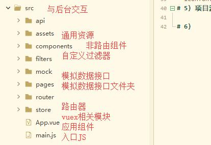
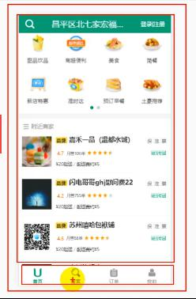

# vue 外卖
# 项目描述：
-这是一个前后台分离的SPA应用
-项目有哪些功能模块？
-项目用到了那些技术？
-项目的开发模式：模块化 项目化 工程化
-API接口（前后台交互接口），url 请求方式  请求参数的格式   响应参数的格式 （接口文档，测接口，对接口，调接口）
-----
1.开启项目开发
使用脚手架创建项目  安装所有依赖或者指定依赖   开发环境运行  生产环境打包与发布   
2.搭建项目整体界面结构
stylus:结构化  变量  函数/minxin混合
vue-router的理解和使用  提供两个属性 所有组件都可以访问  三个缓存路由组件 router-view router-link   keep-alive
    $router 路由器对象 包含一些操作路由的功能函数 来实现路由跳转（编程式导航，而不是通过页面的显示与隐藏）
	$route  当前路由对象 存储当前路由信息数据的容器 path meta  query  params
3.项目路由拆分(技巧)
  底部导航组件 FooterGuide
  导航路由组件 Msite/Search/Order/Personal
4.抽取组件
  头部组件HeaderTop 通过slot占位符 来实现组件通信标签结构
  商家列表组件 ShopList
5. 登录路由组件 （一级路由）隐藏底部导航通过meta($route里面配置meta)实现
6. 后台项目  启动   测试后台接口 使用postman  修正接口文档
7. 前后台交互  使用ajax请求库 axios  封装ajax请求函数  用到axios+promise技术  ，通过promise直接得到response.data数据，而不是response
                                  封装接口请求函数 （请求后台接口必须调用接口请求函数）
8. 
---
# day1
# 1.技术选型（技术架构 主要用到的库和工具）：
- 1）前台数据展现 用的vue技术栈进行组件化开发  vue +ES6 +webpack（打包）
- 2）前后台数据交互发ajax请求使用l了axios库,ajax请求的编码方式可以使用promise形式，也可以使用async await
- 3）测试接口使用postman工具
- 4）模拟数据使用mockJS
- 5) 使用ES6的语法进行模块化，组件化编码（使用babel将ES6转义成ES5，在react项目中babel还用来转义jsx语法），
- 使用webpack进行项目构建，使用脚手架创vue-cli建工程化的项目，使用eslint对代码格式进行检查，使用stylus进行css预编译
- 
- 使用到的插件和第三方库：
- vue-router:开发SPA应用　
- axios:进行前后台数据交互
- vuex:管理应用组件状态
- better-scroll/vue-scroll:实现页面滚动效果
- mockjs:模拟后端数据，
- mint-ui:构建界面
# 2.SPA应用开发
- 1）搭建项目 vue-cli(npm install -g vue-cli  vue init webpack gshop  cd gshop  npm install npm run dev)
- 2）项目结构
- gshop
|-- build : webpack 相关的配置文件夹
|-- config: webpack 相关的配置文件夹
	|-- index.js: 指定的后台服务的端口号和静态资源文件夹（后期需要配置代理:'proxy'）
|-- node_modules:当前应用的依赖
|-- src : 源码文件夹
	|-- main.js: 应用入口 js
|-- static: 静态资源文件夹（全局样式）
|-- .babelrc: babel 的配置文件
|-- .editorconfig: 通过编辑器的编码/格式进行一定的配置
|-- .eslintignore: eslint 检查忽略的配置
|-- .eslintrc.js: eslint 检查的配置（可以修改规则是否打开 或者关闭）
|-- .gitignore: git 版本管制忽略的配置
|-- index.html: 主页面文件
|-- package.json: 应用包配置文件（当前应用相关信息的配置，应用名称，版本号，依赖，运行的命令）
- 3）编码测试与打包发布
- 开发环境运行 npm run  dev（在内存中对项目进行编译打包，并打开浏览器运行(npm  start也可以)）
- 生产环境打包运行  npm  run  build  发布运行（npm  i -g serve下载serve工具包，部署运行dist文件夹）server dist
- 4）标注图（获取）
- 图片Base64：引用的小图片在webpack打包会自动处理转换为样式内部的Base64编码字符串（打包工具以及帮我们做好了）
- 把图片转换成字符串（就成为文件内部的一个部分，不用发送请求），显示时仍然是图片，减少浏览器发送请求的次数；
- 
- 但图片文件不能太大，文件大转换的时间较长，
- 2X和3X图:为了适应不同手机，手机屏幕密度不同
- iconfont：阿里字体图标（引入到index.html文件中）
- 5）项目源码目录设计

- 6）使用Stylus 预编译器
- npm install stylus stylus-loader --save-dev
- (stylus将stylus代码转义成css代码
- stylus-loader 让webpack能够识别stylus)
- 在组件中用stylus语法：<style lang="stylus" rel="stylesheet/stylus">
- 
- 结构化(通过缩进控制 ，不需要大括号和分号)
- 父级引用&
- 变量：mainColor = #0982c1    color mainColor
- 混合Mixins复用CSS

# 3.整体vue应用组件结构
- 
- 
-1)头部的处理
- 1.将头部放在路由组件的外面，跟底部一样
- 2.**将头部与中间的路由组件放在一起  整体作为路由组件部分**
- 3.每个路由组件都有类似的头部，可以将类似的结果抽取成一个单独的组件
-2)定义各个vue组件  基本代码（）
- App.vue
    FooterGuide.vue(底部组件是非路由组件，用来切换路由组件)
	Msite.vue (主页)
	Search.vue(搜索组件)
	Oreder.vue(订单组件)
	Personal.vue(个人组件)
- 3）移动端开发，修改viewport视口  解决300ms延时的问题，引入reset.css
- 4)引入路由 
- 下载vue-router  npm install --save  vue-router
 -------定义路由器 router  index.js----在路由器中配置路由-----在main.js中配置路由器会产生3个标签2个属性 1.标签：<route-link><router-view><eep-alive>  2.属性：$route  $router
 -------修改App.vue  两层结构：上面是路由 下面是导航(引入导航映射成标签)
 
# 4.FooterGuide导航组件
-1 通过编程式导航实现路由的切换显示$router
-2 通过class 和 $route.path 来实现tab样式切换
# 5.导航组件静态页面实现：
-1. 导航栏跟请求路径一致时显示的是on这个样式 要用到class强制样式绑定，根据路径来判断是否有on样式
-2. 点击tab项切换路由  点击监听 
（定义goTo(路径)  this.$router.replace(path)切换路由）
# 6. 4个路由组件的静态页面实现
-1.MSite路由组件 由3部分组成  头部 导航  附近商家（根据定位显示）
使用到了stylus的混合  根据像素比来使用2x和3x图
-2.Search路由组件： 由头部和搜索表单组成
-3.Order路由组件
-4.Personal路由组件
# 7.将4个路由组件的头部抽取成一个非路由组件   slot占位符  props
-在react中有UI组件和容器组件之分  在vue里面有类似的两类组件但是没有用react里面的名字
-1.将头部相关的html代码和css代码抽取到HeaderTop组件中
-2.头部中间内容都是文字，需要声明一个变量接收数据
-3.头部左边和右边 可能有 可能没有内容用slot占位符表示
-4.组件定义好后，去每个组件中引入HeaderTop 映射成标签，使用
# 8.首页轮播实现
-，使用swiper实现图片轮播    (npm install --save swiper不行)
- 参照官网 写JS代码  在创建Swiper对象时  页面应该已经显示 mounted()
- npm install swiper vue-awesome-swiper --save
- 在页面引入
- import Swiper from 'swiper'
- import 'swiper/swiper-bundle.css'
- 
# 9.MSite商家列表抽取成一个组件  shopList一般组件  
-图片资源
# 10.登录注册静态组件 
-点击注册登录 模块 跳转到注册登录界面 login（一级路由）
-一般组件映射成标签 ，路由组件映射成路由router  index.js
-router-link路由连接 包裹 跳转的地方 不再是a标签
-登录界面完成
-tab栏 隐藏  （只有4个路由需要 ） $route当前路由  在配置路由的时候可以配置meta属性
meta   $route.meta meta需要在配置路由的时候配置
#结束

# day2
--异步显示数据
--登录注册
# 11.启动后台测试   前后台交互
- npm i --save  axios
- 1.启动后台服务 通过postman测试接口
- 2.二次封装ajax()(返回的是promise对象)
- 3.根据接口文档  封装接口请求函数
- 4.使用git对项目进行版本控制
 -1） 生成本地仓库  git init    git  add *   git commit -m  'init gshop'
 -2） 创建远程仓库  复制：git remote add origin https://github.com/dingziyong/gshop.git  删除与github 相关的凭据
 -3） 将本地仓库推送到远程仓库  执行上面命令 关联 推送   git push  origin  master  启动github登录界面 登录
#  12.配置代理 实现跨域
- 1.在App.vue组件里面测试请求函数  （浏览器限制跨域）
- 发送异步请求一般是在mounted生命周期函数中，此时请求的路径是8080 需要使用代理服务器转发 4000
-             config  index.js  修改配置  配置代理
- 2.异步显示：用vuex管理从后台获取的数据
- 
#  13 首页数据异步显示：  
- 1.使用vuex管理状态  npm install --save vuex 
- 1）定义管理状态state.js :首页管理的数据：地址  对象;食物列表 [];商家列表 []
- 2）定义mutation types常量名称模块mutation-types.js:
- 3）定义mutations.js模块  直接操作state对象  由action触发（间接修改）
- 4）定义actions.js模块 操作mutations对象
- 5）定义store对象 index.js模块   main.js中注册store 使用上vuex进行状态管理
    - 所有vuex管理的组件中都增加了$store属性，是一个store对象
    - 有属性： state:注册的state对象  getters:注册的getters对象
    - 有方法： dispacth()分发调用action 
- 2.异步显示数据
-  头部：地址// 异步获取 address   this.$store.dispatch('getAddress')
-  食物列表
每一页最多显示8个数据，foodType是一个一维数组，需要整理 变成2维数组，且最大为8
每页显示的内容在数组中
#你项目中有没有遇到什么难题？
-有 在实现异步显示轮播图  页面轮播的过程中遇到了问题，这个轮播应该是在获取数据后界面更新完，就可以实现轮播
   {找不到合适的时机来完成这个 ，最后在网上+vue的官网中找到$nextTick()方法，它是将回调函数延迟到下一次DOM更新之后
   （开始的时候是用定时器，随便给的时间 等待页面获取数据并展现出来后，再来轮播）}
通过vuex发送ajax获取foodTypes一维数组，通过计算属性对数据进行整合计算将一维数组改为特定的二维数组，
   内部数组最大长度不能超过8,用于一个页面显示食品的个数，外层数据控制页数
   使用Swiper显示轮播，需要在界面更新之后创建Swiper对象
   1）使用回调函数+ $nextTick()
   2）使用watch+ $nextTick():采用的这种方式
-  商家列表
-  1.发送请求获取数据（MSite组件中，ShopList组件中发都一样）
-  2.ShopList读state状态
-  3.
### -3.数据异步显示的步骤（1.调用action发请求获取数据，数据存储在state；2.读state状态  3.写模板显示）
-  4.商家列表 获取图像的域名 失效  无法获取商家图片
#day3
- 使用svg显示动图  (懒加载  )
#  14.star组件
- star组件在多个界面使用，将其抽取成可复用的组件，
- star的class根据评分 来
- 整数部分为on  小数部分大于5 则half 长度小于5时 其它的都是off
#  15.注册登录效果
-  1.界面相关的效果
-  1）切换登录方式
标识登录属性  属性值为true绿色 显示 为false隐藏 无on属性
-  2）手机号合法性检查
-  查看接口文档
-  /^1(3|4|5|6|7|8|9)\d{9}$/
输入正确的手机号后  "获取验证码"的变成黑色 显示效果通过计算属性来判断
-  3）倒计时效果
点击 倒计时的效果  (注意用户可能连续点击多次，)
-  4）切换显示或隐藏密码
-  5）前台验证提示
-  
#异步数据显示：从后台获取数据要做的事情(写的代码)：
1.ajax  发送ajax请求  ：promise+axios封装ajax请求函数
               封装每个接口对应的请求函数，也就是根据接口定义ajax请求函数，使用接口调用接口函数就可以了
	解决ajax的跨域问题，配置代理proxy(浏览器将请求提交到前台端口号，代理拦截前端请求并转发到服务器端口)
	代理服务器运行在前台 监听的前台的端口
2.vuex  从后台获取的数据要使用vuex来管理
	创建相关模块 store/index（vuex核心管理对象模块）|state(状态对象)|mutations（里面包含多个直接更新state的方法对象）
	|actions（接收组件通知$emit，操作mutation对象 封装多个间接更新state的方法对象 ）|getters（基于state的计算属性
	|mutation-types（mutation和action之间进行交互的常量模块，由多个mutation 的type常量名称组成的模块）
	实现各个模块的功能
1）设计state:从后台获取的数据,在vuex管理的这个状态里面包含哪些状态属性，
2）实现actions:  定义异步action(async await)
	流程：发送ajax请求获取数据，commit给mutation
3) 实现mutations
4）实现index
5)main.js配置store对象，增加$store和store， 	
	$store有state对象  getters: 增加了dispacth()分发调用action 
3.组件异步展示数据
	1)在mounted()生命周期函数中 通过$store.dispatch('actionName')
	 触发异步action调用，从后台获取数据,数据存储在store里面
	2)读数据：mapState(['xxx'])读取state中数据到组件中
	3)在模板里面显示xxx的数据
	 模板中显示数据的来源：
	 data:自身的数据
	 props：外部传入的数据（外部改变）
	 computed:计算属性数据来源 ，根据自身data/props ，有a，b计算属性b可以根据a进一步计算（别的compute）
	                         vuex管理的state  getters
	
####前后台交互相关问题
	1)如何查看应用是否发生某个ajax请求：浏览器的network
	2）发ajax请求404状态码，请求的资源不存在，  可能是请求的路径不对，代理配置了没有重启，服务没有运行
	3）后台返回了数据，但是页面没有显示？
	   vuex中是否有返回的数据    组件中是否读取数据

-  2.前后台交互功能
-  1）动态一次性图像验证码
-  初始化显示  点击切换（SVG数据，干扰线）[请求路径](http://localhost:4000/captcha)
-  2）动态一次性短信验证码
-  容联云腾讯短信平台  注册账号   后台添加相应的参数
-  
-  3）短信登录
-  4）密码登录
-  5）获取用户信息实现自动登录
-  
-  登录更新跳转路由，登录后跳转到userInfo界面，MSite页面的登录信息也需要修改
-  
-  6）自动登录和退出登录
-  自动登录
-  前面用户信息保存在state中不能保持登录，页面一刷新就没有了。因此在刷新页面，初始化显示时需要自动发送请求
-  获取用户信息。在后台项目中，是使用session会话机制存储用户信息 （后台登录成功后将user._id存储在session中，）
-  session会话机制：会话： 打开浏览器会话开始，关闭浏览器会话结束
-           持久会话：浏览器关闭 会话还能够维持maxAge
- session会话是基于cookie的
-  ，登录状态靠
-  退出登录
-  登录以后在"我的"界面中就会出现一个按钮"" 使用mint-ui组件库
-  npm  i --save mint-ui（标签组件  非标签组件）
- 下载 按需打包的 工具包： npm install --save-dev babel-plugin-component  只引入2个组件就打包2个组件，样式自动打包
-  修改babel配置
#  搭建商家整体界面
-  拆分路由 路由的定义，配置，使用
-  模拟数据接口（mock)
-     数据的设计
- ShopHeader组件
- 1）异步显示数据
-    ajax请求
-    vuex管理状态
#  总结
- 1.完成登录/注册
-     2种方式
- 2.登录的基本流程
-    1)表单的前端验证，如果不合法则提醒
-    2)发送ajax请求，得到返回结果 
-    3)根据结果的表示code来判断是否登录成功
-       1 不成功则显示提示
-       0 成功  保存用户信息  返回到上次路由
- 3.vue自定义事件
-     绑定监听：@eventName= 'fn'
-     分发事件：this.$emit('eventName',data)
#  day4
#  滑动效果分析ShopGoods
#  mutations  购物车 数量+ - 
- 在点餐时 购物车里的食物数量 + - 在这里数据传递的是food 但是food只是goods的一个属性
- 当之前点餐数量为0 时，新增食物  不仅要给goods新增属性值，还需要添加属性名，
- food.count = 1是无法动态渲染的，（让新增的属性也有数据绑定）
- Vue.set(food,"count",1)//（参数： 对象 属性名 属性值）让新增的属性也有数据绑定
#  